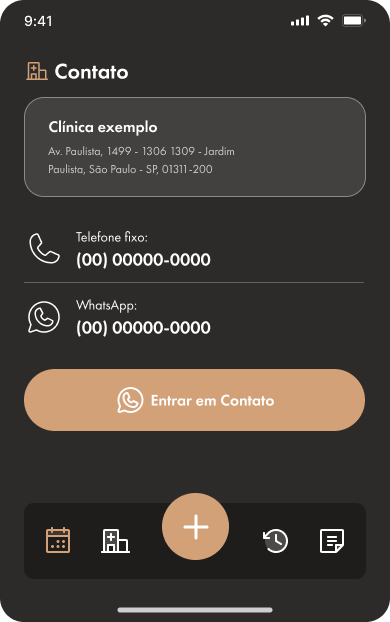

# 🔵 Agendar consulta

## Como agendar uma consulta?

* Clique no ícone de "+" na barra de navegação;
* Você será redirecionado para a lista de clínicas;

<figure><figcaption></figcaption></figure>

* As clínicas serão listadas de acordo com a distância, da mais próxima a mais distante;
* Selecione uma das opções e clique em `Confirmar`;

<figure><figcaption></figcaption></figure>

* Na tela exibida pelo sistema, serão listadas informações da clínica selecionada com um botão para prosseguir com o atendimento pelo Whatsapp;
* Clique em `Entrar em Contato` para prosseguir com o atendimento;

<figure><figcaption></figcaption></figure>

## Gerenciar endereço

* Para gerenciar o endereço, basta acessar a lista de clínicas como mostrado acima e clicar no ícone de engrenagem;

<figure><figcaption></figcaption></figure>

* Você será redirecionado para a tela de gerenciamento de endereço;
* Preencha os campos solicitados pelo sistema e clique em `Salvar endereço`;

<figure><figcaption></figcaption></figure>
