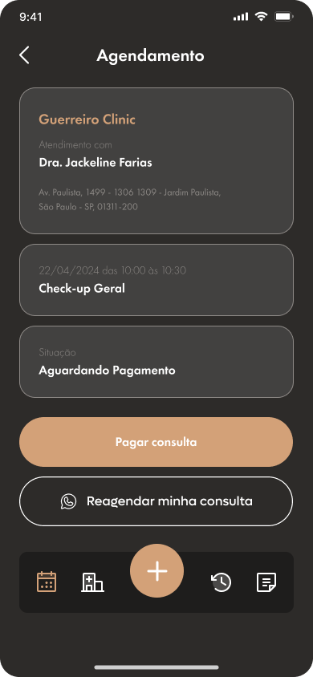
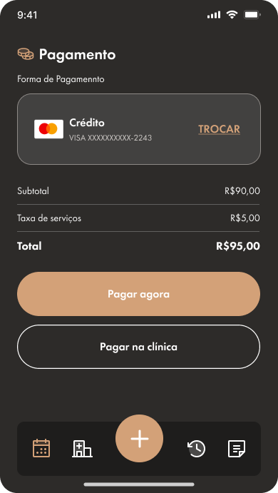

# 🔵 Gerenciar consulta

## Como reagendar uma consulta?

* Clique no ícone de Calendário na barra de navegação;
* Você será redirecionado para a lista de agendamentos;

<figure><figcaption></figcaption></figure>

* Clique sobre o agendamento que deseja reagendar;
* Você será redirecionado para a página de detalhes do agendamento;

<figure><figcaption></figcaption></figure>

* Na tela exibida pelo sistema, serão listadas informações da clínica e do agendamento;
* Clique em `Reagendar minha consulta` para prosseguir com o atendimento;

## Como pagar a consulta via aplicativo?

* Clique no ícone de Calendário na barra de navegação;
* Você será redirecionado para a lista de agendamentos;

<figure><figcaption></figcaption></figure>

* Clique sobre o agendamento que deseja pagar;
* Você será redirecionado para a página de detalhes do agendamento;

<figure><figcaption></figcaption></figure>

* Na tela exibida pelo sistema, serão listadas informações da clínica e do agendamento;
* Clique em `Pagar consulta`;
* O sistema mostrará a tela inicial de pagamento;
* Clique em `Pagar agora`;

<figure><figcaption></figcaption></figure>
