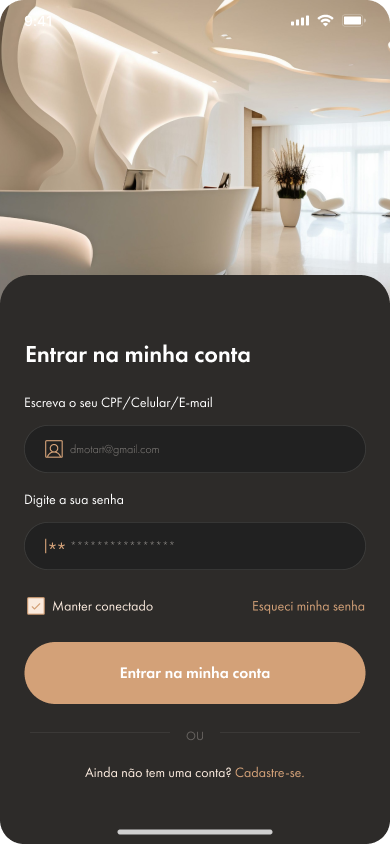

# 🔵 Recuperar acesso

## Como recuperar acesso a minha conta?

* Acesse o aplicativo e clique em `Entrar`;
* Você será redirecionado para a tela acesso;

<figure><figcaption></figcaption></figure>

* Clique em `Esqueci minha senha`;

<figure><figcaption></figcaption></figure>

* Você será redirecionado a tela inicial de recuperação de acesso;
* Na tela exibida, informe o número de celular cadastrado na conta que deseja recuperar o acesso;
* Clique em `Enviar código`;

<figure><figcaption></figcaption></figure>

* Você será redirecionado para outra tela e um código de validação será enviado ao número de celular informado anteriormente;
* Informe o código de validação de 6 dígitos recebido por SMS;
* Clique em `Confirmar`;


Caso você não tenha recebido o código, clique em `Reenviar código`. Você poderá solicitar um novo código a cada 5 minutos.


<figure><figcaption></figcaption></figure>

* Você será redirecionado para a tela de cadastro de nova senha;
* Cadastre uma nova senha de acesso e selecione a checkbox de termos de uso;
* Clique em `Registrar`;

<figure><figcaption></figcaption></figure>
