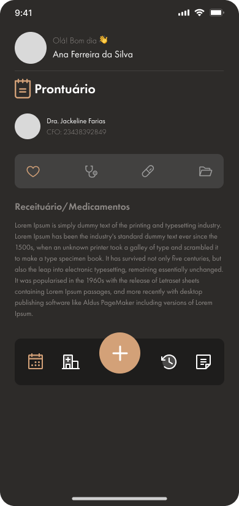

# 🔵 Visualizar prontuários

## Como visualizar os prontuários?&#x20;

* Clique em Prontuários na barra de navegação.
* Você será redirecionado para s lista de atendimentos.

<figure><figcaption></figcaption></figure>

* Em seguida preencha o formulário gerado para o atendimento.

## Os questionários são divididos pelas 4 abas seguintes:

* No símbolo de coração, é possivel realizar o formulário de Saúde bucal:

<figure><figcaption></figcaption></figure>

* No símbolo de estetoscópio, é possível realizar o formulário de Exame Clínico:

<figure><figcaption></figcaption></figure>

* No símbolo de cápsula, é possí1vel realizar o formulário de Receituário e Medicamentos:

<figure><figcaption></figcaption></figure>

* No símbolo de pasta, é possível acessar Documentos:

<figure><figcaption></figcaption></figure>
