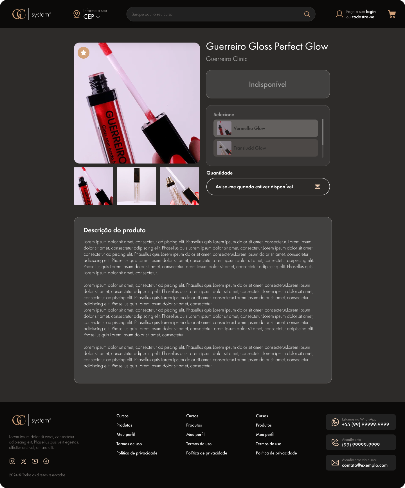
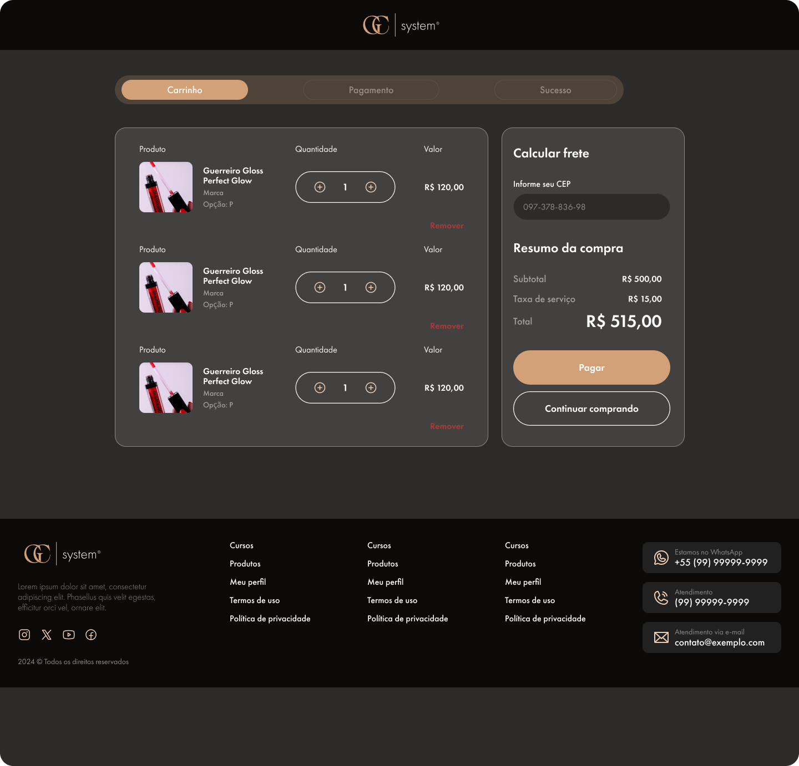
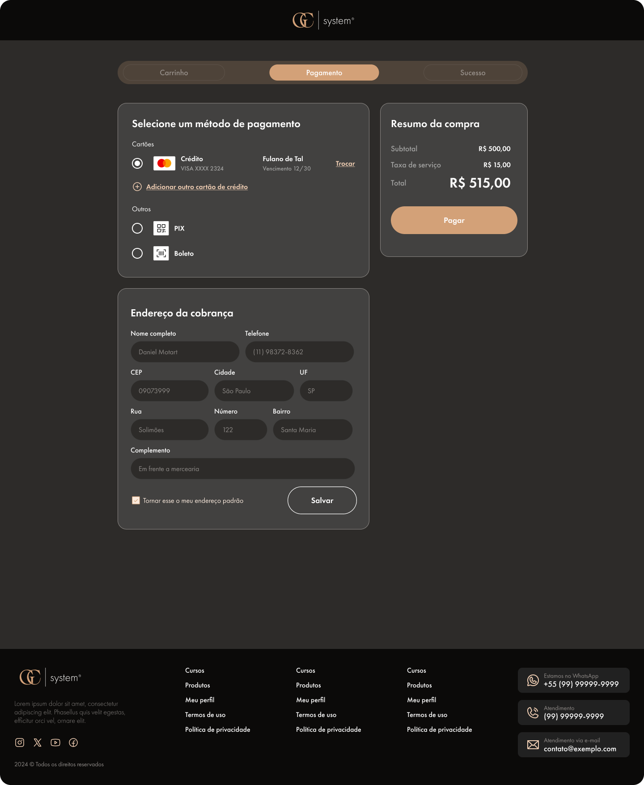
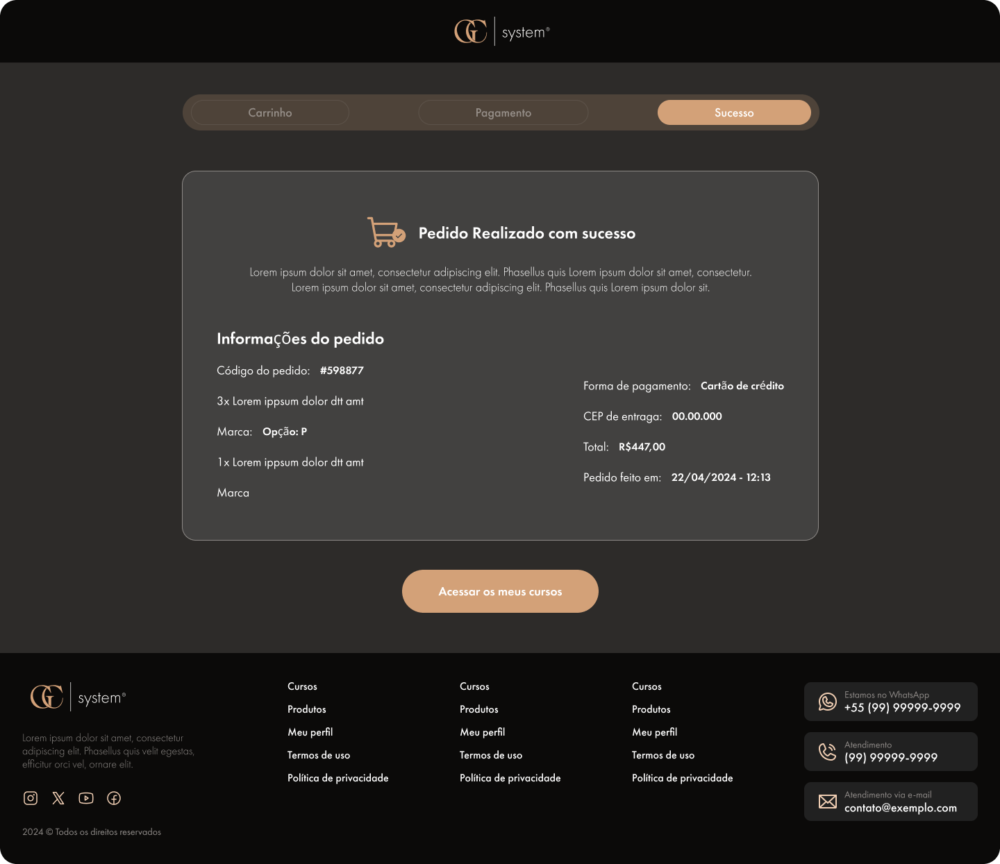

# 🟤 Comprar produto

## Como comprar produtos?

* **Escolha seus produtos**: Navegue pelas categorias e adicione os produtos desejados ao carrinho:&#x20;

<figure><figcaption></figcaption></figure>

* Ao clicar em um produto, será mostrado detalhes:

<figure><figcaption></figcaption></figure>

* Se acabar o estoque de um produto, ele ira aparecer como `produto indisponível;`

<figure><figcaption></figcaption></figure>

* **Revisão do Pedido**: Acesse o carrinho de compras para revisar os itens selecionados e o valor total da compra:

<figure><figcaption></figcaption></figure>

* **Pagamento**: Selecione a forma de pagamento preferida e prossiga para a tela de comprovação do pagamento.
* Após escolher a forma de pagamento e preencher o endereço de cobrança, clique em `pagar:`

<figure><figcaption></figcaption></figure>

* **Confirmação do Pedido**: Após o pagamento, você receberá uma confirmação por e-mail com os detalhes do seu pedido.

<figure><figcaption></figcaption></figure>

